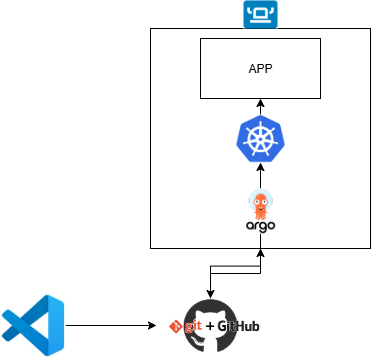
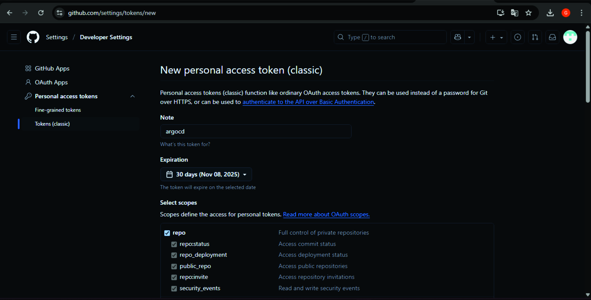
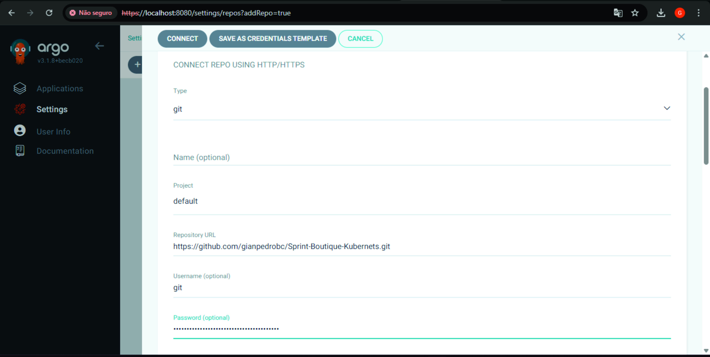
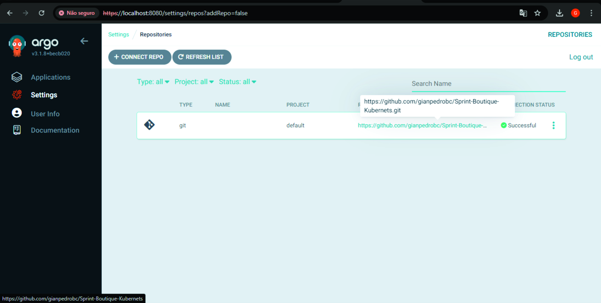

# Projeto GitOps: ArgoCD + Rancher Desktop + Online Boutique

## Visão geral rápida

Neste projeto vamos:

1. Preparar um cluster Kubernetes local usando **Rancher Desktop**.
2. Instalar e configurar **ArgoCD** no cluster para operar GitOps.
3. Criar um repositório Git contendo os manifests Kubernetes.
4. Configurar uma **Application** no ArgoCD.
5. Validar o deploy da aplicação **Online Boutique** no namespace `boutique` e acessar o frontend localmente.

## Diagrama (arquitetura simplificada)

<h3 align="center">Arquitetura do Projeto</h3>

<p align="center">
  
</p>


## Pré-requisitos 

* Rancher Desktop instalado (com Kubernetes habilitado).
* kubectl disponível e apontando para o cluster.
* Conta no GitHub e repositório público criado.


## VER SE O CLUSTER ESTÁ ATIVO NO RANCHER

No Rancher Desktop:

1. Abra o aplicativo Rancher Desktop.
2. Na tela principal verifique o status: deve aparecer “Kubernetes Running” ou parecido.
3. Em "Preferences" / "Kubernets" voce consegue ver a versão do kubernetes.


## Instalar o Argo CD no cluster

### ETAPA 2 — Criar o namespace do ArgoCD

No terminal:

```bash
kubectl create namespace argocd
```

* Cria um namespace isolado `argocd` onde todos os pods/serviços do ArgoCD irão ficar.

### ETAPA 3 — Instalar o ArgoCD

Aplicar o manifesto oficial (um único manifesto que cria CRDs, deployments, services, RBAC etc.):

link:
```
https://github.com/GoogleCloudPlatform/microservices-demo
```

```bash
kubectl apply -n argocd -f https://raw.githubusercontent.com/argoproj/argo-cd/stable/manifests/install.yaml
```

Verifique os pods:

```bash
kubectl -n argocd get pods
```
Aguarde até que todos os pods estejam com STATUS `Running` (pode levar alguns minutos).

## ETAPA 4 — Acessar o painel web do ArgoCD

### Porta-forward 

No terminal (Diferente) :

```bash
kubectl port-forward svc/argocd-server -n argocd 8080:443
```

* O comando cria um túnel: `localhost:8080` → `argocd-server:443`.
* Mensagens como `Handling connection for 8080` indicam que o túnel está funcionando e atendendo conexões.

Abra no navegador:

```
https://localhost:8080
```

* O navegador exibirá um aviso de certificado (ERR_CERT_AUTHORITY_INVALID). Isso é normal pois o certificado é autoassinado. Clique em “Avançado” → “Continuar para localhost (não seguro)”.

## ETAPA 5 — Fazer login no ArgoCD

A senha inicial do usuário `admin` está armazenada num Secret. No PowerShell (Windows) decodifique assim:

```powershell
kubectl -n argocd get secret argocd-initial-admin-secret -o jsonpath="{.data.password}" | % { [System.Text.Encoding]::UTF8.GetString([System.Convert]::FromBase64String($_)) }
```

Login no ArgoCD:

* Usuário: `admin`
* Senha: (saída do comando acima)

<p align="center">
  
</p>


## Preparar o repositório Git

Estrutura recomendada no seu repositório GitHub (ex. nome: `sprint-boutique-kubernets`):

```
sprint-boutique-kubernets/
└── gitops-microservices/
    └── k8s/
        └──Kubernetes-manifests.yaml
└── README.md
```

## ETAPA 7 — Conectar o ArgoCD ao seu repositório

### ArgoCD Application Web

1. No painel do ArgoCD clique **NEW APP**.
2. Preencha:

   * Application Name: `sprint-boutique-kubernets` (tudo em minúsculas)
   * Project: `default`
   * Repository URL: `https://github.com/SEU-USUARIO/SEU-REPO.git`
   * Revision: `HEAD`
   * Path: `gitops-microservices/k8s`
   * Cluster: `https://kubernetes.default.svc`
   * Destination Namespace: `boutique`
   * Sync Policy: selecionar **Automatic** 
3. Clique em **Create**.
---
4. Imagens: 
<h3 align="center">Configuração do ArgoCD</h3>
---
<p align="center">
  
</p>
---
<p align="center">
  
</p>
---
<p align="center">
  
</p>

## ETAPA 8 — Testar o aplicativo

### Garantir que o namespace do app exista

```bash
kubectl create namespace boutique
```

## Acessar o frontend da Online Boutique

Se o serviço `frontend` estiver presente (ver com `kubectl get svc -n boutique`), exponha localmente com `port-forward`:

```bash
kubectl port-forward svc/frontend -n boutique 8081:80
```

* Abra no navegador: `http://localhost:8081`.

Observações:

* Mantenha o terminal com `port-forward` aberto enquanto estiver usando a aplicação.
---
<h3 align="center">Aplicativo Online Boutique</h3>
---
<p align="center">
  
</p>
---
<p align="center">
  
</p>
---
<p align="center">
  
</p>


## Integração com Repositório Git Privado ao ArgoCd

# 🚀 Integração do Argo CD com Repositório Git Privado

Este guia descreve o processo completo para integrar o **Argo CD** a um **repositório Git privado**, garantindo segurança e controle total sobre o código da sua aplicação.

---

## 🔐 Formas de Conexão

O Argo CD pode se conectar a um repositório Git privado de duas maneiras:

- **Usando Personal Access Token (PAT)** → método mais simples e direto.  
- **Usando chave SSH** → ideal para ambientes mais restritos.

Neste guia, faremos a configuração **via PAT**.

---


### Personal Access Token (PAT) válido
Crie seu token diretamente no GitHub seguindo os passos:

1. Acesse **Settings (Perfil, não do repositorio) → Developer Settings → Personal Access Tokens → Tokens (classic)**.  
2. Clique em **Generate new token**.  
3. Dê um nome identificável (ex: `argocd`).  
4. Selecione o escopo : repo
---
<p align="center">
  
</p>
---
## Conectando o Repositório ao ArgoCD

Agora, com a URL e o PAT prontos, siga o passo a passo dentro da interface do **Argo CD (UI)**:

### Acesse as Configurações
- No menu lateral, clique no ícone de engrenagem ou (**Settings**).
- Selecione **Repositories**.

### Adicione um Novo Repositório
- Clique em **+ CONNECT REPO**.
- Escolha **Connect via HTTPS**.

### Preencha os Campos
No formulário de conexão, insira:

| Campo | Valor |
|-------|--------|
| **Repository URL** | `https://github.com/seu-usuario/seu-repositorio-privado.git` |
| **Username** | Seu nome de usuário do GitHub (ex: `gianpedrobc`) |
| **Password** | O seu **Personal Access Token (PAT)** criado anteriormente |
---
<p align="center">
  
</p>
---
<p align="center">
  
</p>


# Deploy passo-a-passo com Helm Chart + Argo CD

**Objetivo:** criar um Helm Chart (`mynginx`), validar localmente, enviar ao repositório Git e implantar automaticamente via **Argo CD**.

---

## 1) Criar o Helm Chart (local)

Abra o terminal na pasta do seu projeto e execute:

```bash
helm create mynginx
```

Isso gerará a estrutura:

```
mynginx/
├── Chart.yaml
├── values.yaml
└── templates/
    ├── deployment.yaml
    ├── service.yaml
    ├── ingress.yaml
    └── ...
```

> Edite `values.yaml` e/ou os arquivos em `templates/` conforme necessário (nome do app, porta, image, resources, etc).

---

## Testar instalando localmente 

Crie uma namespace de teste e instale o chart:

```bash
kubectl create namespace nginx-demo
helm install mynginx ./mynginx -n nginx-demo
kubectl get pods -n nginx-demo
```

Para acessar temporariamente a aplicação localmente:

```bash
kubectl port-forward svc/mynginx -n nginx-demo 8082:80
# depois abra no navegador:
# http://localhost:8082
```

Se tudo funcionar e quiser limpar o ambiente de teste:

```bash
helm uninstall mynginx -n nginx-demo
kubectl delete namespace nginx-demo
```

---

## Preparar o repositório Git (GitOps)

Coloque a pasta `mynginx/` no repositório (na raiz ou em um subpath que você escolher):

```
<Sprint-Boutique-Kubernets>/
└── mynginx/
    ├── Chart.yaml
    ├── values.yaml
    └── templates/...
```

Depois:

```bash
git add mynginx
git commit -m "Add Helm chart mynginx"
git push origin main
```

>Se o repositório for **privado**, certifique-se de que o Argo CD tem acesso (PAT/SSH) antes de criar a Application.

---

## Abrir o ArgoCD

Se você usa acesso local via `kubectl port-forward`:

```bash
kubectl port-forward svc/argocd-server -n argocd 8080:443
# abra: https://localhost:8080
# ignore o aviso de certificado (autoassinado)
```

Faça login com seu usuário/senha do Argo CD (`admin` + senha inicial).

---

## Criar a Application no Argo CD

No Argo CD UI clique em **NEW APP** e preencha os campos:

* **Application Name:** `mynginx`
* **Project:** `default`
* **Repository URL:**
  * HTTPS: `https://github.com/<seu-usuario>/<seu-repo>.git`
  * OU SSH: `git@github.com:<seu-usuario>/<seu-repo>.git`
* **Revision:** `main` 
* **Path:** `mynginx`  ← *pasta que contém `Chart.yaml`*
* **Cluster:** `https://kubernetes.default.svc`
* **Namespace:** `default` 
* **Sync Policy:** `Automated`

Clique **Create**.

---

## Sincronizar (deploy) e verificar

Na Application criada:

1. Clique em **SYNC** → **SYNCHRONIZE**.
2. Aguarde o Argo CD renderizar o chart e aplicar os manifestos.

Verifique no terminal:

```bash
kubectl get pods -n default
kubectl get svc -n default
kubectl get deploy -n default
```

Para acessar via port-forward:

```bash
kubectl port-forward svc/mynginx -n default 8082:80
# abrir: http://localhost:8082
```