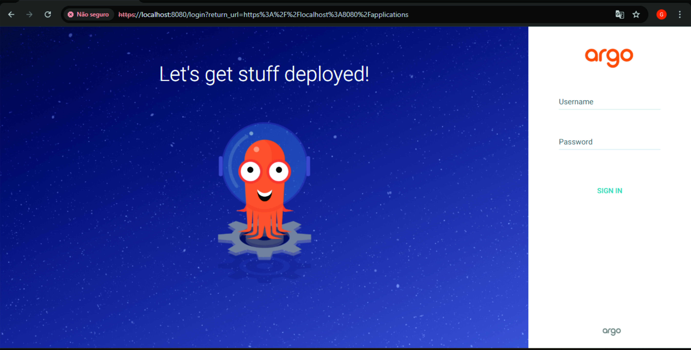
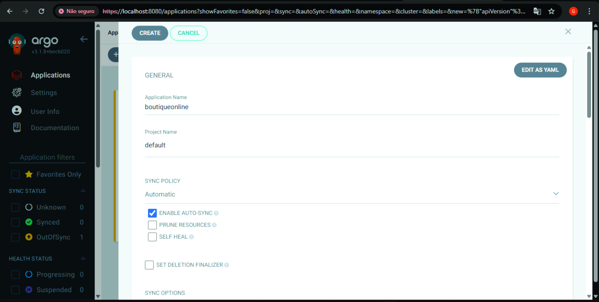
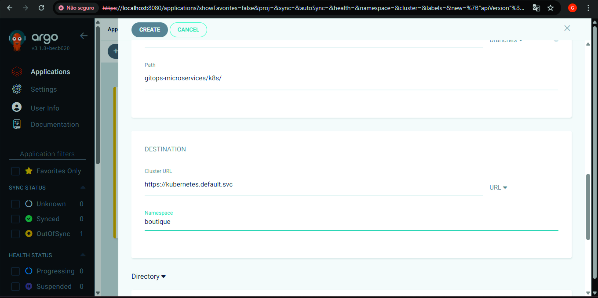
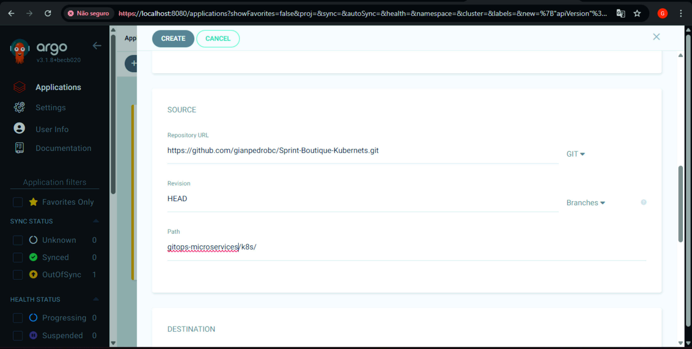
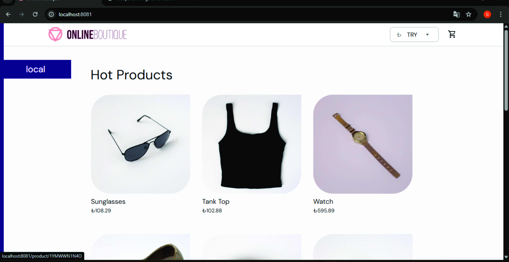
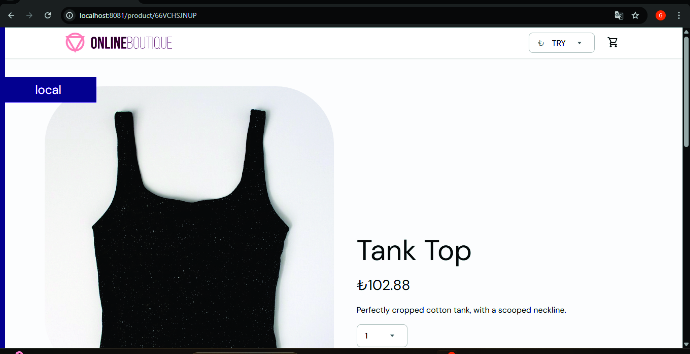
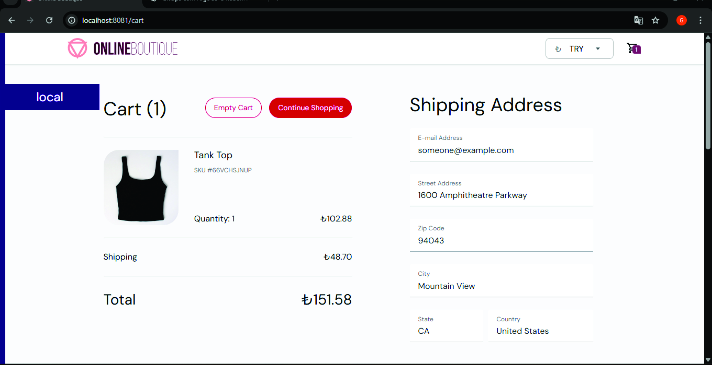

# Documentação GitOps: ArgoCD + Rancher Desktop + Online Boutique

## Visão geral rápida (o que vamos fazer)

Neste projeto vamos:

1. Preparar um cluster Kubernetes local usando **Rancher Desktop**.
2. Instalar e configurar **ArgoCD** no cluster para operar GitOps.
3. Criar um repositório Git contendo os manifests Kubernetes (pasta `gitops-microservices/k8s`).
4. Configurar uma **Application** no ArgoCD que aponte para o repositório (path `gitops-microservices/k8s`) e sincronize automaticamente.
5. Validar o deploy da aplicação **Online Boutique** no namespace `boutique` e acessar o frontend localmente.

## Diagrama (arquitetura simplificada)

<h3 align="center">Arquitetura do Projeto</h3>

<p align="center">
  
</p>


## Pré-requisitos — checando e instalando (passo a passo)

Checklist antes de começar:

* Rancher Desktop instalado (com Kubernetes habilitado).
* Git instalado e configurado.
* kubectl disponível e apontando para o cluster (`kubectl version --client`).
* Conta no GitHub e repositório público criado.
* (Opcional) Docker/docker engine disponível para builds locais.


## VER SE O CLUSTER ESTÁ ATIVO NO RANCHER

No Rancher Desktop (GUI):

1. Abra o aplicativo Rancher Desktop.
2. Na tela principal verifique o status: deve aparecer “Kubernetes Running” ou parecido.
3. Em "Preferences" / "Kubernets" voce consegue ver a versão do kubernetes.


## Instalar o Argo CD no cluster

### ETAPA 2 — Criar o namespace do ArgoCD

No terminal:

```bash
kubectl create namespace argocd
```

Explicação:

* Cria um namespace isolado `argocd` onde todos os pods/serviços do ArgoCD irão residir.

### ETAPA 3 — Instalar o ArgoCD

Aplicar o manifesto oficial (um único manifesto que cria CRDs, deployments, services, RBAC etc.):

```bash
kubectl apply -n argocd -f https://raw.githubusercontent.com/argoproj/argo-cd/stable/manifests/install.yaml
```

Verifique os pods:

```bash
kubectl -n argocd get pods
```
Aguarde até que todos os pods estejam com STATUS `Running` (pode levar alguns minutos).

## ETAPA 4 — Acessar o painel web do ArgoCD

### Porta-forward (modo local — simples e seguro)

No terminal (Diferente) :

```bash
kubectl port-forward svc/argocd-server -n argocd 8080:443
```

* O comando cria um túnel: `localhost:8080` → `argocd-server:443`.
* Mensagens como `Handling connection for 8080` indicam que o túnel está ativo e atendendo conexões.

Abra no navegador:

```
https://localhost:8080
```

* O navegador exibirá um aviso de certificado (ERR_CERT_AUTHORITY_INVALID). Isso é normal pois o certificado é autoassinado. Clique em “Avançado” → “Continuar para localhost (não seguro)”.

## ETAPA 5 — Fazer login no ArgoCD

A senha inicial do usuário `admin` está armazenada num Secret. No PowerShell (Windows) decodifique assim:

```powershell
kubectl -n argocd get secret argocd-initial-admin-secret -o jsonpath="{.data.password}" | % { [System.Text.Encoding]::UTF8.GetString([System.Convert]::FromBase64String($_)) }
```

Login no ArgoCD:

* Usuário: `admin`
* Senha: (saída do comando acima)

<p align="center">
  
</p>


## Preparar o repositório Git

Estrutura recomendada no seu repositório GitHub (ex. nome: `sprint-boutique-kubernets`):

```
sprint-boutique-kubernets/
└── gitops-microservices/
    └── k8s/
        └──Kubernetes-manifests.yaml
└── README.md
```

Passos para preparar:

1. No GitHub crie o repositório público.
2. Localmente, na pasta do projeto:

   ```bash
   git init
   git branch -M main
   git remote add origin https://github.com/SEU-USUARIO/SEU-REPO.git
   git add .
   git commit -m "Add manifests and argocd app"
   git push -u origin main
   ```

## ETAPA 7 — Conectar o ArgoCD ao seu repositório

### ArgoCD Application Web

1. No painel do ArgoCD clique **NEW APP**.
2. Preencha:

   * Application Name: `sprint-boutique-kubernets` (tudo em minúsculas)
   * Project: `default`
   * Repository URL: `https://github.com/SEU-USUARIO/SEU-REPO.git`
   * Revision: `HEAD`
   * Path: `gitops-microservices/k8s`
   * Cluster: `https://kubernetes.default.svc`
   * Destination Namespace: `boutique`
   * Sync Policy: selecionar **Automatic** 
3. Clique em **Create**.
4. Imagens: 
<h3 align="center">Configuração do ArgoCD</h3>

<p align="center">
  
</p>

<p align="center">
  
</p>

<p align="center">
  
</p>

## ETAPA 8 — Testar o aplicativo

### Garantir que o namespace do app exista

```bash
kubectl create namespace boutique
```

## Acessar o frontend da Online Boutique

Se o serviço `frontend` estiver presente (ver com `kubectl get svc -n boutique`), exponha localmente com `port-forward`:

```bash
kubectl port-forward svc/frontend -n boutique 8081:80
```

* Abra no navegador: `http://localhost:8081`.

Observações:

* Mantenha o terminal com `port-forward` aberto enquanto estiver usando a aplicação.
<h3 align="center">Aplicativo Online Boutique</h3>

<p align="center">
  
</p>

<p align="center">
  
</p>

<p align="center">
  
</p>


## Solução de erros comuns (Que passei)


3. `release: app path does not exist`

   * Causa: `source.path` do ArgoCD aponta para pasta que não existe no repo.
   * Solução: confirme o path (ex.: `gitops-microservices/k8s`) e garanta que os arquivos estejam nesse caminho no GitHub.

4. `Namespace ... is missing`

   * Causa: manifests não especificam `metadata.namespace` e o Application não definiu `destination.namespace`.
   * Solução:

     * Defina `destination.namespace` no `argocd-app.yaml` (recomendado), ex.: `boutique`.
     * Ou adicione `namespace: boutique` em cada manifest.
     * E garanta que o namespace exista: `kubectl create namespace boutique`.

5. `services "frontend" not found`

   * Causa: serviço não criado ainda, ou criado em outro namespace.
   * Solução:

     * Verifique namespace correto: `kubectl get svc -A | grep frontend`.
     * Faça `argocd app sync` ou via UI clique em Sync.
     * Verifique logs dos pods se o Service existir mas não houver pods.


